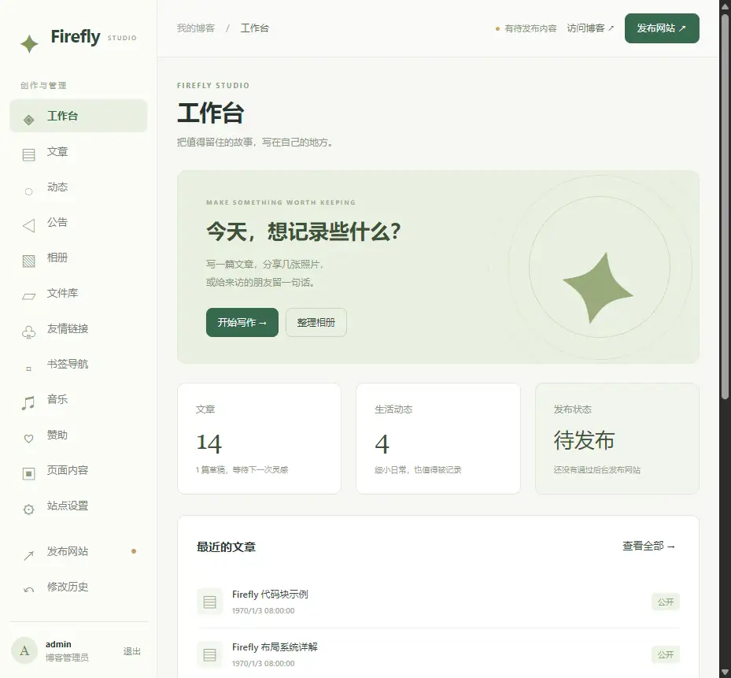

# Firefly 管理后台

Firefly 原本只有静态前台。本分支增加一个独立 Node.js 后端和 Svelte 管理界面，适用于有持久化磁盘的 Linux 云服务器。

日常操作是：登录 `/admin/` → 编辑或上传 → 保存 → 点击“发布网站”。后端自动执行检查、构建和搜索索引生成，成功后切换网站版本。无需手动编辑 TypeScript、Frontmatter 或在终端运行发布命令。

## 功能

- 文章、草稿、动态的创建、编辑和删除；标题、日期、分类、标签、置顶、版权等使用表单。
- Markdown 正文编辑、排版按钮、图片/附件选择与安全预览。
- 选择源码目录中的素材时，自动复用到公共文件库；新图片在发布前也可在正文预览中查看。
- 公告、相册、友链、书签、歌单、赞助者、个人资料以及全部 24 个配置模块的表单管理。
- 相册本地图片上传、删除、远程图片地址维护；封面、标签、日期与相册密码。
- 文件库：图片、音视频、PDF、ZIP、文本、歌词、字体的上传、预览/下载、引用地址复制和删除。
- 关于我、留言板、友链附加内容、页脚文案。
- 修改历史、删除恢复、防止多窗口覆盖、发布日志、失败保留旧版、上一版网站回退。
- 独立管理员登录、密码哈希、HttpOnly 会话、来源与 CSRF 检查、登录限流、文件路径及上传内容校验。

完整的内容来源及管理边界见 [内容盘点](content-inventory.md)。



## 本地使用

项目要求 Node.js **22.23+** 和 pnpm。

```bash
pnpm install --frozen-lockfile
pnpm admin:setup
pnpm admin
```

初始化会创建被 Git 忽略的 `.env.admin`，生成一次性的随机初始密码并在终端显示。请保存密码。再次运行初始化不会覆盖已有账号。

访问 `http://localhost:4322/admin/`。账号默认是 `admin`。后台会在启动时单独编译管理界面；即使还没有构建博客，也能登录并发布。

若端口被占用或被 Windows 保留，请同时修改 `.env.admin` 中的 `ADMIN_PORT` 和 `ADMIN_ORIGIN`，例如改为 `18472` 与 `http://localhost:18472`。浏览器中的域名和端口必须与 `ADMIN_ORIGIN` 一致。

`pnpm dev` 和 `pnpm preview` 仍然服务于原博客前台；它们不提供后台 API。

## Linux 服务器部署

1. 将**完整项目**放到服务器，例如 `/srv/firefly`，安装依赖。后台需要源码、`public`、`node_modules` 和构建工具，不能只上传 `dist`，也不能只安装生产依赖。
2. 使用专门的普通系统用户运行服务，并使这个用户拥有项目目录的读写权限。单个站点只运行一个后台进程，不使用 PM2 cluster 或多个副本共享写入。
3. 运行 `pnpm admin:setup`，保存初始密码，然后修改 `.env.admin`：

```dotenv
ADMIN_USERNAME=admin
# 使用初始化生成的 scrypt 哈希，不要填写明文密码
ADMIN_PASSWORD_HASH=scrypt:这里保留初始化生成的完整内容
ADMIN_HOST=127.0.0.1
ADMIN_PORT=4322
ADMIN_ORIGIN=https://blog.example.com
```

4. 在后台“站点设置 → 站点设置”中，将网站完整地址也改成你的实际域名。公网访问必须使用 HTTPS。
5. 用 systemd 等进程管理器保持后台运行。示例文件见 [firefly-admin.service](firefly-admin.service)。调整用户、目录和 pnpm 路径后安装：

```bash
sudo cp docs/admin/firefly-admin.service /etc/systemd/system/firefly-admin.service
sudo systemctl daemon-reload
sudo systemctl enable --now firefly-admin
sudo journalctl -u firefly-admin -f
```

6. 为 Nginx 配置域名与 HTTPS 证书，并使用 [nginx.conf.example](nginx.conf.example) 中的代理规则。**整个站点都代理给 Node 服务**：后端从当前成功的发布目录提供静态页面。不要另配 `root /srv/firefly/dist`，否则后台切换发布版本后访客仍会看到旧文件。
7. 登录 `https://blog.example.com/admin/`，点击“发布网站”。原有 `dist` 如果存在，会在第一次后台发布之前作为回退页面提供访问。

首次和后续发布都执行 `pnpm check`、`pnpm type-check`、`pnpm build`。构建需要足够的内存和磁盘空间；当前主题还会访问字体、GitHub 卡片和已启用的追番数据源，需要服务器可以访问这些服务。

该模式面向 Linux 主机，不适合仅部署静态资源的 GitHub Pages，也不能直接依赖 Vercel、Cloudflare Workers 等无持久化本地磁盘的环境。使用本后台时不要设置 `CF_WORKERS`。

## 保存、发布与回退

- **保存**更新原内容文件。前台仍显示上一个发布版本；本地 `pnpm dev` 会读取最新源文件。
- **发布**在 `.firefly-admin/releases/<编号>` 构建新版本。全部检查和构建成功后，原子更新 `.firefly-admin/state.json`，下一次请求即使用新版本。
- **发布失败**保留原线上版本和编辑内容，日志中显示失败步骤。编辑期间不会覆盖已发布目录。
- **发布中**暂时禁止保存、上传、删除和恢复，避免一次构建混入多批内容。不要在发布同时从终端修改源文件或运行另一个构建。
- **回退上一版**只切换线上页面，保留已保存的源内容。要继续修改，请编辑后再次发布。
- **修改历史 → 撤销修改**恢复到某次修改之前。若同一文件此后又发生变化，会拒绝覆盖；可按时间从新到旧依次撤销。
- 删除相册信息会下架相册，其图片保留在文件库。删除单张相册照片使用文件库；正文或配置仍在引用的文件会阻止删除。

发布日志保存在当前服务内存中，重启后重置；当前和上一版网站、源文件及历史备份保存在磁盘中。异常退出遗留的服务锁会在原进程已结束时自动清除；如果锁内 PID 仍存在，则拒绝启动第二个服务。

## 数据与备份

| 路径 | 用途 |
| --- | --- |
| `src/content` | 文章、动态与固定页面内容 |
| `src/config` | 后台表单对应的原主题配置；保持源码为唯一数据来源 |
| `public/uploads` | 新上传的公共素材与附件 |
| `public/gallery/<相册标识>` | 相册照片及 `urls.txt` |
| `src/assets/images`、`public/assets` 等 | 原有素材，后台可以读取与管理受支持的文件 |
| `.env.admin` | 管理员用户名、密码哈希、监听地址与允许的站点来源 |
| `.firefly-admin/history` | 修改前的文件快照及操作记录 |
| `.firefly-admin/releases` | 构建出的静态版本 |
| `.firefly-admin/state.json` | 内容版本、当前与上一版发布指针 |
| `.firefly-admin/ui` | 独立管理界面构建产物，重启时重新生成 |

定期备份整个站点内容、素材、`.env.admin` 和 `.firefly-admin`。历史快照和发布目录会占用磁盘，需纳入服务器备份及磁盘监控。旧发布目录可以在停止服务后清理，但必须保留 `state.json` 中的 `active.directory` 和 `previous.directory`。不要将 `.firefly-admin` 映射成 Nginx 静态根目录。

后台修改直接保存在服务器文件中，**不会自动提交或推送 Git**。更新主题或从远程拉代码前，应先备份/提交服务器内容变更，再解决配置合并，避免覆盖后台保存的内容。现有配置中的环境变量覆盖规则继续有效。

忘记密码：停止后台，备份并移走 `.env.admin`，重新运行 `pnpm admin:setup`，恢复原来的域名/端口配置后启动。会话在重启后失效，重新初始化不会修改文章和相册。

## 编辑边界

- 新文章使用 Markdown。已有 MDX 文章可以编辑元信息；其正文若要在后台编辑，需要显式转换为 Markdown。转换保留原文件快照，但 MDX 组件表达式会成为普通文字，转换后应检查正文。后台不会执行管理员提交的 JavaScript。
- 正文预览只显示基础 Markdown 排版，不包含主题的全部图表、加密、指令和 Astro 组件；最终以构建后的页面为准。
- 相册和文章的密码沿用原主题的前端加密设计，**不等于服务器级文件访问控制**。上传的素材在发布后可以通过其公开 URL 访问。
- 评论/留言、Memos、Bilibili、Bangumi、VNDB、MyAnimeList、统计报表由外部平台保存。后台管理连接与展示设置，内容审核或收藏增删仍由各平台完成。
- 自定义 TypeScript 计算表达式保留为只读。导航栏提供独立的“自定义菜单”开关和列表；关闭时继续使用原主题菜单。
- 文件库不接受 HTML、JavaScript、SVG、可执行程序或任意源码上传；支持 JPG/JPEG/PNG/WebP/AVIF/GIF、MP3/WAV/OGG/M4A/MP4/WebM、PDF/ZIP/TXT/LRC、WOFF/WOFF2/TTF/OTF。默认单文件上限 64 MB。

## 开发验证

```bash
pnpm admin:test
pnpm check
pnpm type-check
pnpm build
```

浏览器测试可运行 `node scripts/admin/qa-server.mjs`。它会复制内容到 `.firefly-admin/qa-*`，使用独立会话和一次性密码，只在本机 `18473` 端口监听，不改动真实内容。QA 服务中的发布使用测试替身，仅用于验证界面与版本切换；真实构建由 `pnpm build` 验证。测试结束后停止进程，测试副本可以删除。

2026-09-13 验证记录：后台测试 9 项通过，`pnpm check` 检查 255 个文件且无错误、警告或提示，`pnpm type-check` 通过。常规构建和指定 `FIREFLY_OUT_DIR` 的构建均通过，生成 36 个页面和 Pagefind 索引。构建仍有原主题的缺失图标目录、大文件块及部分跳转页不参与索引等提示。

浏览器已验证登录、公告保存、新建相册、上传照片、新建草稿、图片选择与未发布图片预览、内容保存和删除、历史列表、发布及上一版回退。390px 手机视口的工作台和文章列表无横向溢出，导航可展开并在选择页面后收起。浏览器发布使用上述测试替身，未连接或部署到生产服务器。
